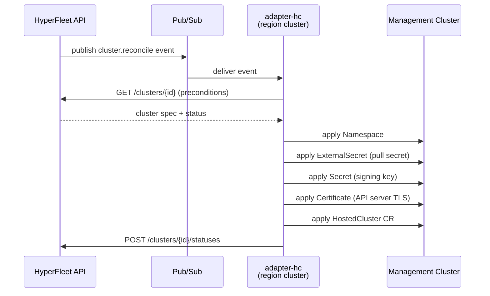
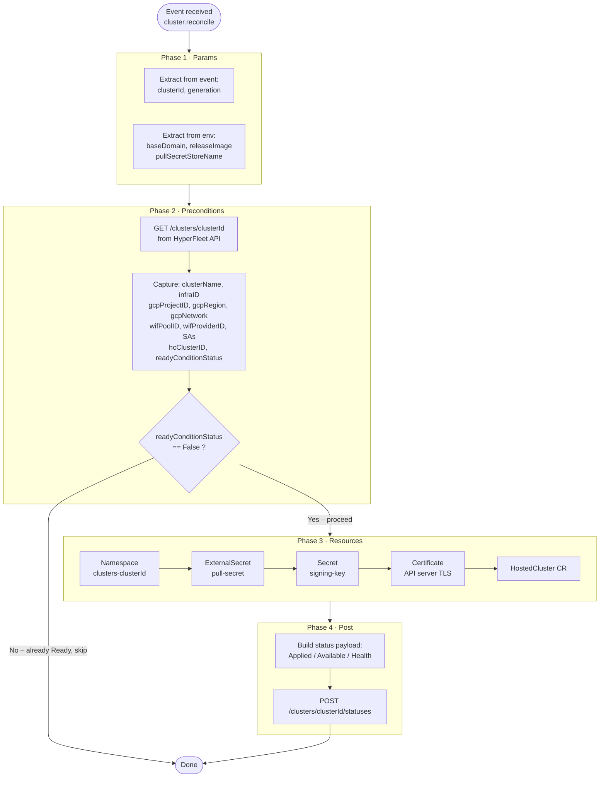
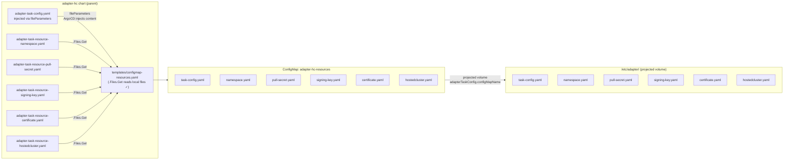
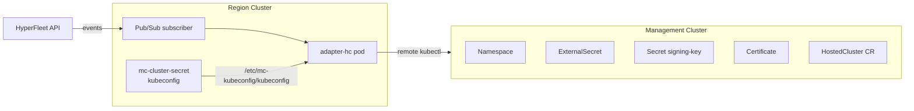

# adapter-hc: HostedCluster Provisioning Adapter

This Helm chart deploys the HyperFleet adapter responsible for provisioning
OpenShift HostedClusters on GCP management clusters in response to cluster
lifecycle events.

## Overview

When a cluster is created or updated in the HyperFleet API, the Sentinel
publishes a reconcile event to a Pub/Sub topic. The adapter receives that
event, validates preconditions, applies a set of Kubernetes resources to the
management cluster, and reports status back to the HyperFleet API.



## Adapter Lifecycle Phases

The adapter processes each event in four sequential phases defined in
`adapter-task-config.yaml`:



## Chart Structure

`adapter-hc` is a **wrapper chart**: it declares `hyperfleet-adapter` as a
Helm dependency. The upstream chart provides all the Deployment, RBAC, and
ServiceAccount templates. This chart adds:

- Configuration files specific to HostedCluster provisioning
- A `templates/configmap-resources.yaml` that packages all config into a
  single ConfigMap (see [ConfigMap Design](#configmap-design) below)

```
charts/adapter-hc/
├── Chart.yaml                          # declares hyperfleet-adapter dependency
├── Chart.lock
├── values.yaml                         # Helm values (broker, image, volumes…)
│
├── adapter-config.yaml                 # AdapterConfig: clients & broker settings
├── adapter-task-config.yaml            # AdapterTaskConfig: the 4-phase task definition
│
├── adapter-task-resource-namespace.yaml      # Resource 0: Namespace
├── adapter-task-resource-pull-secret.yaml    # Resource 1: ExternalSecret (pull secret)
├── adapter-task-resource-signing-key.yaml    # Resource 2: Secret (signing key)
├── adapter-task-resource-certificate.yaml    # Resource 3: Certificate (API TLS)
├── adapter-task-resource-hostedcluster.yaml  # Resource 4: HostedCluster CR
│
├── templates/
│   └── configmap-resources.yaml        # Packages task-config + resource files
│                                       # into adapter-hc-resources ConfigMap
└── charts/
    └── hyperfleet-adapter-1.0.0.tgz   # upstream chart (helm dep update)
```

## ConfigMap Design

The upstream `hyperfleet-adapter` chart projects adapter configuration into
`/etc/adapter/` inside the pod via a Kubernetes **projected volume**. The
adapter process then reads `task-config.yaml` from that directory and resolves
any `manifest.ref` paths relative to the same base directory.

### The Wrapper Chart File-Access Problem

Helm's `$.Files.Get` inside a subchart template can only see files within
**that subchart's** directory — not the parent chart's files. This means the
upstream chart's ConfigMap template cannot package our resource files directly.

### Solution

We own the task-config ConfigMap ourselves via `templates/configmap-resources.yaml`:



Key settings that wire this together in `values.yaml`:

```yaml
hyperfleet-adapter:
  adapterTaskConfig:
    create: false                    # don't let upstream create its own
    configMapName: adapter-hc-resources  # use ours instead
```

The upstream deployment's projected volume picks up `adapter-hc-resources`
and places all keys under `/etc/adapter/`, so `manifest.ref: "/etc/adapter/namespace.yaml"`
resolves correctly inside the adapter process.

## Resource Files

Each Kubernetes resource applied to the management cluster has its own file.
Resources are templated by the HyperFleet adapter's Go runtime (not by Helm),
using values captured from the HyperFleet API response in Phase 2.

| File | Kind | Namespace | Applied to |
|------|------|-----------|------------|
| `adapter-task-resource-namespace.yaml` | Namespace | cluster-scoped | Management cluster |
| `adapter-task-resource-pull-secret.yaml` | ExternalSecret | `clusters-{clusterId}` | Management cluster |
| `adapter-task-resource-signing-key.yaml` | Secret | `clusters-{clusterId}` | Management cluster |
| `adapter-task-resource-certificate.yaml` | Certificate | `clusters-{clusterId}` | Management cluster |
| `adapter-task-resource-hostedcluster.yaml` | HostedCluster | `clusters-{clusterId}` | Management cluster |

All resources carry two discovery labels used by the adapter to find existing
resources idempotently (avoiding duplicate creation):

```yaml
labels:
  hyperfleet.io/cluster-id: "{{ .clusterId }}"
  hyperfleet.io/resource-type: "<type>"  # namespace / pull-secret / signing-key / certificate / hosted-cluster
```

## Dual-Cluster Architecture

The adapter pod runs on the **region cluster** but applies resources to the
**management cluster** via a remote kubeconfig:



The management cluster kubeconfig is stored in a Kubernetes `Secret`
(`mc-cluster-secret`) and mounted read-only into the adapter pod. The
`adapter-config.yaml` points the Kubernetes client at this kubeconfig path.

## Deployment (ArgoCD)

This chart is deployed via ArgoCD. The ArgoCD Application uses `fileParameters`
to inject the YAML files (which ArgoCD reads from the chart source directory
and sets as Helm string values):

```yaml
helm:
  fileParameters:
    - name: hyperfleet-adapter.adapterConfig.yaml
      path: adapter-config.yaml
    - name: hyperfleet-adapter.adapterTaskConfig.yaml
      path: adapter-task-config.yaml
```

The `adapter-task-config.yaml` content is then available in our
`configmap-resources.yaml` template as:

```
(index .Values "hyperfleet-adapter").adapterTaskConfig.yaml
```

## Configuration Reference

| Value | Description | Set in |
|-------|-------------|--------|
| `broker.googlepubsub.projectId` | GCP project hosting the Pub/Sub topic | ArgoCD template |
| `broker.googlepubsub.subscriptionId` | Pub/Sub subscription name | `values.yaml` |
| `env.HC_BASE_DOMAIN` | Base domain for hosted cluster DNS | ArgoCD template |
| `env.HC_RELEASE_IMAGE` | OCP release image for HostedCluster | ArgoCD template |
| `env.PULL_SECRET_STORE_NAME` | ExternalSecret ClusterSecretStore name | ArgoCD template |
| `env.PULL_SECRET_GCP_KEY` | Secret Manager key for pull secret | ArgoCD template |
| `adapterTaskConfig.configMapName` | Name of the combined task-config ConfigMap | `values.yaml` |
